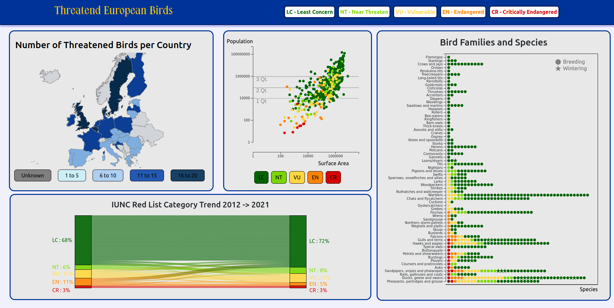

# Information Visualization Group21

Run server:

```
python3 -m http.server
```

## IMPORTANT

The whole programming progress was done on __Full-HD__ resolution. We were not able to test on other resolution and responsive programming was'nt the focus of the dashboard.

__If your display resolution is more then Full-HD, please lower the ZOOM level in the browser to have the correct format:__


